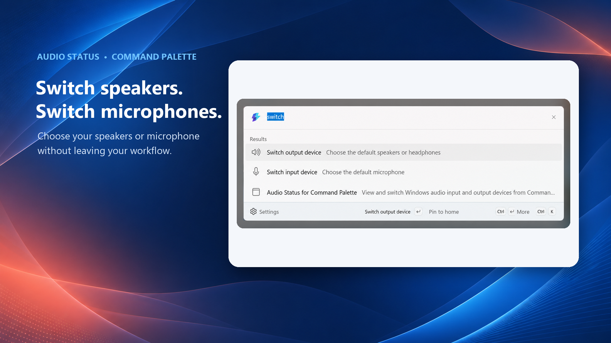

# Audio Status

Audio Status is a Microsoft PowerToys Command Palette extension for viewing and switching Windows audio input and output devices.

Project repository: https://github.com/hansek/AudioStatusExtension

## Features

- Shows current default output and input devices.
- Lists active playback and recording endpoints.
- Switches default output or input devices from Command Palette.
- Provides top-level commands for switching output and input devices directly from search.
- Provides a dock band with current audio device status.

## Requirements

- Windows 10 19041 or newer, or Windows 11.
- Microsoft PowerToys with Command Palette support.

## Publishing

Publishing notes and gallery submission templates are in [PUBLISHING.md](PUBLISHING.md).

### Release Build in Visual Studio

The simplest way to create a release package:

1. Right-click the `AudioStatusExtension` project.
2. Select `Publish...`.
3. Choose the `store-x64` profile.
4. Click `Publish`.

## Privacy

Privacy policy: [PRIVACY.md](PRIVACY.md)
